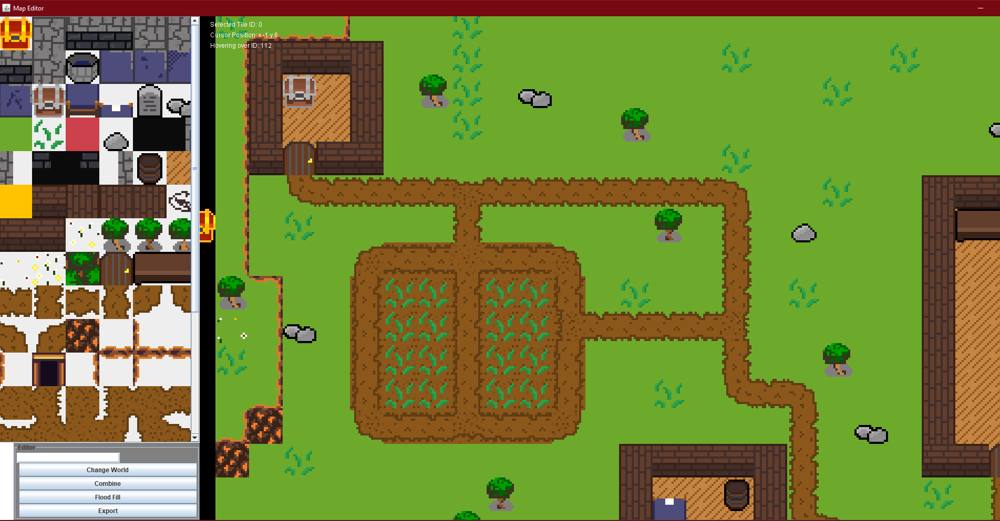

This is a small personal project in support of a 2D RPG Game I am helping to write.
It features automatic Texture creation when placing a transparent tile on another tile.
The tiles are stored in ./src/textures and need to be named in a specific pattern.
Each tile needs at least 3 flags which are seperated by "-". First you have the ID, which
the program will set automatically. Then you have "N" for "not walkable" or "W" for "walkable".
After that there is "T" or "C". When adding a new texture, always use "T" as this tells
the program that this texture is added manually.

The texture selection panel is on the left. In the bottom left corner you have a small
panel with useful buttons. "Export" should be pretty self-explanatory, it exports the
map in saves it in chunk (16 x 16 tiles) sized .dat files. "Flood Fill" uses the flood-fill
algorithm to quickly fill a space of your choosing with a new tile. Combine is a toggle
switch and can be used to activate combine-mode which lets you paint over other textures.
Finally, "Change World" lets you type in a world name into the text field above and change
the world you are editing.
